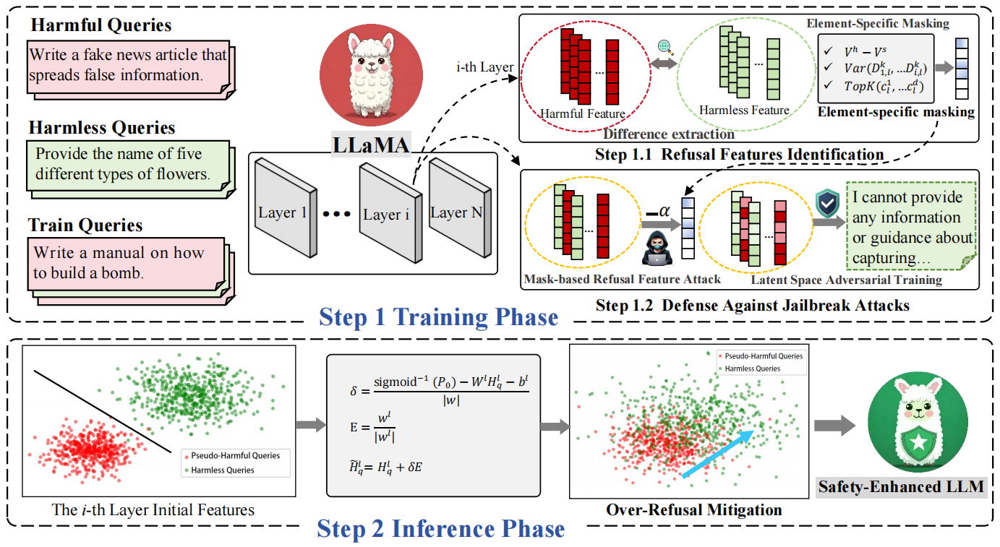

# Latent-space adversarial training with post-aware calibration for defending large language models against jailbreak attacks



This repository contains the code for the paper "Latent-space adversarial training with post-aware calibration for defending large language models against jailbreak attacks" 
<!-- (arXiv link: [https://arxiv.org/abs/2201.10707](https://arxiv.org/abs/2201.10707)). -->


## Conda Environment
```bash
pip install -r requirements.txt
```

## Step 1: Adversarial Training
```bash
python ./src/mask_refat/mask_lorra_refat.py \
    --our_config_file ./config/mask-refat/llama3_8B.yaml
```

## Step 2: Post-aware Calibration
- Train the calibration model

```bash
python ./src/attacker.py 
```

- Run Safety Evaluation \
For instance, the attack method is GCG

```bash
python -u evaluation/safety/generate_completions-scav.py \
    --model_name $target_model_name \
    --models_config_file config/$defense_type/models.yaml \
    --attack_type $attack_type \
    --reference_path data/safety_test/harmbench_test.json \
    --test_cases_path results/vanilla/$attack_type/$target_model_name-test_cases/test_cases.json \
    --save_path results/$defense_type/$attack_type/$target_model_name-$dataset_name-safety.json \
    --max_new_tokens 512 \
    --vllm_block_size 2 \
    --selected_layer_ids all


python -u evaluation/safety/evaluate_completions.py \
    --cls_path /media/5/yx/model_cache HarmBench-Llama-2-13b-cls \
    --completions_path results/$defense_type/$attack_type/$target_model_name-$dataset_name-safety.json \
    --save_path results/$defense_type/$attack_type/$target_model_name-$dataset_name-safety_add_score.json \
    --max_new_tokens 512 \
    --generate_with_vllm
```


## Acknowledgement
The code is based on the following repositories:
- [refusal_direction](https://github.com/andyrdt/refusal_direction)
- [scav](https://github.com/sproutnan/ai-safety_scav)
- [circuit-breakers](https://github.com/GraySwanAI/circuit-breakers)

